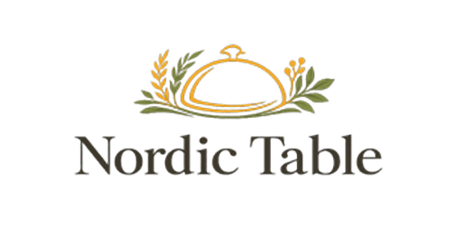

<a id="readme-top"></a>

<!-- PROJECT SHIELDS -->
<!-- Improved compatibility of back to top link: See: https://github.com/othneildrew/Best-README-Template/pull/73 -->

<a id="readme-top"></a>

<!--
*** Thanks for checking out the Best-README-Template. If you have a suggestion
*** that would make this better, please fork the repo and create a pull request
*** or simply open an issue with the tag "enhancement".
*** Don't forget to give the project a star!
*** Thanks again! Now go create something AMAZING! :D
-->

<!-- PROJECT SHIELDS -->
<!--
*** I'm using markdown "reference style" links for readability.
*** Reference links are enclosed in brackets [ ] instead of parentheses ( ).
*** See the bottom of this document for the declaration of the reference variables
*** for contributors-url, forks-url, etc. This is an optional, concise syntax you may use.
*** https://www.markdownguide.org/basic-syntax/#reference-style-links
-->

[![Contributors][contributors-shield]][contributors-url]
[![Forks][forks-shield]][forks-url]
[![Stargazers][stars-shield]][stars-url]
[![Issues][issues-shield]][issues-url]
[![Unlicense License][license-shield]][license-url]
[![LinkedIn][linkedin-shield]][linkedin-url]

<!-- PROJECT LOGO -->
<br />
<div align="center">
  
  <h3 align="center">Nordic Table — Front-end</h3>
  <p align="center">
    Eksamensprojekt: Moderne React + Tailwind frontend til et nordisk restaurant-bookingsystem.
    <br />
    <strong>Se loginoplysninger til demo nedenfor!</strong>
    <br />
    <br />
    <a href="#om-projektet">Om projektet</a>
    &middot;
    <a href="#kom-i-gang">Kom i gang</a>
    &middot;
    <a href="#brug">Brug</a>
    &middot;
    <a href="#demo-login">Demo Login</a>
  </p>
</div>

<!-- TABLE OF CONTENTS -->
<details>
  <summary>Table of Contents</summary>
  <ol>
    <li>
      <a href="#about-the-project">About The Project</a>
      <ul>
        <li><a href="#built-with">Built With</a></li>
      </ul>
    </li>
    <li>
      <a href="#getting-started">Getting Started</a>
      <ul>
        <li><a href="#prerequisites">Prerequisites</a></li>
        <li><a href="#installation">Installation</a></li>
      </ul>
    </li>
    <li><a href="#usage">Usage</a></li>
    <li><a href="#roadmap">Roadmap</a></li>
    <li><a href="#contributing">Contributing</a></li>
    <li><a href="#license">License</a></li>
    <li><a href="#contact">Contact</a></li>
    <li><a href="#acknowledgments">Acknowledgments</a></li>
  </ol>
</details>

<!-- ABOUT THE PROJECT -->

## Om projektet

Dette er frontend-delen af **Nordic Table** restaurantens bookingsystem. Appen gør det muligt for brugere at se menuen, booke et bord og for admin at administrere bookinger via et beskyttet backoffice.

**Stack:**

- React 18+
- Tailwind CSS 4
- Formik & Yup (formularer/validering)
- React Router v6+
- React Icons, React Toastify, clsx

**Funktioner:**

- Responsivt, moderne UI
- Bookingformular med validering
- Admin backoffice (beskyttet side)
- 404 Not Found-side
- Toast-notifikationer for fejl/succes

<p align="right">(<a href="#readme-top">Til toppen</a>)</p>

### Bygget med

- [React](https://react.dev/)
- [Tailwind CSS](https://tailwindcss.com/)
- [Formik](https://formik.org/) & [Yup](https://github.com/jquense/yup)
- [React Router](https://reactrouter.com/)
- [React Icons](https://react-icons.github.io/react-icons/)
- [React Toastify](https://fkhadra.github.io/react-toastify/)

<p align="right">(<a href="#readme-top">Til toppen</a>)</p>

<!-- GETTING STARTED -->

## Kom i gang

### Forudsætninger

- Node.js >= 18
- npm >= 9

### Installation

1. Klon repoet:

```sh
git clone https://github.com/sleiterr/md_nordic_table
cd nordic_table-front-end
```

2. Installer afhængigheder:

```sh
npm install
```

3. Opret miljøvariabler:

Projektet kræver en .env-fil i roden af front-end mappen for at fungere korrekt.

Eksempel på .env:

```
VITE_API_BASE_URL=http://localhost:3042
```

Denne variabel bruges til at angive adressen til backend-API'et.

**Husk:**

- Opret filen `.env` hvis den ikke findes.
- Udskift URL'en hvis du bruger en anden backend-adresse eller port.

4. Start udviklingsserveren:

```sh
npm run dev
```

5. Åbn projektet på adressen fra terminalen, fx [http://localhost:5173](http://localhost:5173) i din browser.

<p align="right">(<a href="#readme-top">Til toppen</a>)</p>

<!-- USAGE EXAMPLES -->

## Brug

- Forside: menu, restaurantinformation
- Booking: formular til bordreservation
- Backoffice: bookingadministration (kun for admin)
- 404: side for ukendte ruter

<p align="right">(<a href="#readme-top">Til toppen</a>)</p>

## Demo Login

For at logge ind som admin (backoffice), brug:

- Email: `admin@mediacollege.dk`
- Adgangskode: `admin`

<p align="right">(<a href="#readme-top">Til toppen</a>)</p>

<!-- ROADMAP -->

## Projektstruktur

```
nordic_table_front-end/
├── public/
│   └── favicon/
├── src/
│   ├── assets/
│   ├── components/
│   ├── hooks/
│   ├── pages/
│   ├── utils/
│   ├── App.jsx
│   └── main.jsx
├── package.json
├── tailwind.config.js
├── vite.config.js
└── README.md
```

<p align="right">(<a href="#readme-top">Til toppen</a>)</p>

```
nordic_table_front-end/
├── public/
│   └── favicon/
├── src/
│   ├── assets/
│   ├── components/
│   ├── hooks/
│   ├── pages/
│   ├── utils/
│   ├── App.jsx
│   └── main.jsx
├── package.json
├── tailwind.config.js
├── vite.config.js
└── README.md
```

<p align="right">(<a href="#readme-top">back to top</a>)</p>

<!-- CONTRIBUTING -->

## Bidrag

Bidrag, forslag og fejlmeldinger er velkomne! Fork repoet og lav et pull request, eller opret et issue.

<p align="right">(<a href="#readme-top">Til toppen</a>)</p>

Contributions, suggestions, and issues are welcome! Fork the repo and open a pull request, or create an issue.

<p align="right">(<a href="#readme-top">back to top</a>)</p>

<!-- LICENSE -->

## Licens

Distribueret til uddannelsesbrug. Se `LICENSE.txt` for mere information.

<p align="right">(<a href="#readme-top">Til toppen</a>)</p>

Distributed for educational purposes. See `LICENSE.txt` for more information.

<p align="right">(<a href="#readme-top">back to top</a>)</p>

<!-- CONTACT -->

## Kontakt

Forfatter: Oleg Troian (MediaCollege, 2026)  
Email: oleg4troian@gmail.com  
Portfolio: [olegtr.netlify.app](https://olegtr.netlify.app/)  
LinkedIn: [linkedin.com/in/oleg-troian-031922250](https://www.linkedin.com/in/oleg-troian-031922250/)  
GitHub: [github.com/sleiterr](https://github.com/sleiterr)  
Se udvidet dokumentation i [dokumentation.md](./dokumentation.md)

<p align="right">(<a href="#readme-top">back to top</a>)</p>

<!-- ACKNOWLEDGMENTS -->

## Tak til

- [Tailwind CSS Docs](https://tailwindcss.com/docs)
- [React Docs](https://react.dev/)
- [Formik Docs](https://formik.org/docs/overview)
- [React Router Docs](https://reactrouter.com/en/main)
- [React Toastify](https://fkhadra.github.io/react-toastify/)

<p align="right">(<a href="#readme-top">Til toppen</a>)</p>

- [Tailwind CSS Docs](https://tailwindcss.com/docs)
- [React Docs](https://react.dev/)
- [Formik Docs](https://formik.org/docs/overview)
- [React Router Docs](https://reactrouter.com/en/main)
- [React Toastify](https://fkhadra.github.io/react-toastify/)

<p align="right">(<a href="#readme-top">back to top</a>)</p>

<!-- MARKDOWN LINKS & IMAGES -->
<!-- https://www.markdownguide.org/basic-syntax/#reference-style-links -->

[contributors-shield]: https://img.shields.io/github/contributors/othneildrew/Best-README-Template.svg?style=for-the-badge
[contributors-url]: https://github.com/othneildrew/Best-README-Template/graphs/contributors
[forks-shield]: https://img.shields.io/github/forks/othneildrew/Best-README-Template.svg?style=for-the-badge
[forks-url]: https://github.com/othneildrew/Best-README-Template/network/members
[stars-shield]: https://img.shields.io/github/stars/othneildrew/Best-README-Template.svg?style=for-the-badge
[stars-url]: https://github.com/othneildrew/Best-README-Template/stargazers
[issues-shield]: https://img.shields.io/github/issues/othneildrew/Best-README-Template.svg?style=for-the-badge
[issues-url]: https://github.com/sleiterr/md_nordic_table/issues
[license-shield]: https://img.shields.io/github/license/othneildrew/Best-README-Template.svg?style=for-the-badge
[license-url]: https://github.com/othneildrew/Best-README-Template/blob/master/LICENSE.txt
[linkedin-shield]: https://img.shields.io/badge/-LinkedIn-black.svg?style=for-the-badge&logo=linkedin&colorB=555
[linkedin-url]: https://www.linkedin.com/in/oleg-troian-031922250/
[product-screenshot]: images/screenshot.png
[Next.js]: https://img.shields.io/badge/next.js-000000?style=for-the-badge&logo=nextdotjs&logoColor=white
[Next-url]: https://nextjs.org/
[React.js]: https://img.shields.io/badge/React-20232A?style=for-the-badge&logo=react&logoColor=61DAFB
[React-url]: https://reactjs.org/
[Vue.js]: https://img.shields.io/badge/Vue.js-35495E?style=for-the-badge&logo=vuedotjs&logoColor=4FC08D
[Vue-url]: https://vuejs.org/
[Angular.io]: https://img.shields.io/badge/Angular-DD0031?style=for-the-badge&logo=angular&logoColor=white
[Angular-url]: https://angular.io/
[Svelte.dev]: https://img.shields.io/badge/Svelte-4A4A55?style=for-the-badge&logo=svelte&logoColor=FF3E00
[Svelte-url]: https://svelte.dev/
[Laravel.com]: https://img.shields.io/badge/Laravel-FF2D20?style=for-the-badge&logo=laravel&logoColor=white
[Laravel-url]: https://laravel.com
[Bootstrap.com]: https://img.shields.io/badge/Bootstrap-563D7C?style=for-the-badge&logo=bootstrap&logoColor=white
[Bootstrap-url]: https://getbootstrap.com
[JQuery.com]: https://img.shields.io/badge/jQuery-0769AD?style=for-the-badge&logo=jquery&logoColor=white
[JQuery-url]: https://jquery.com
